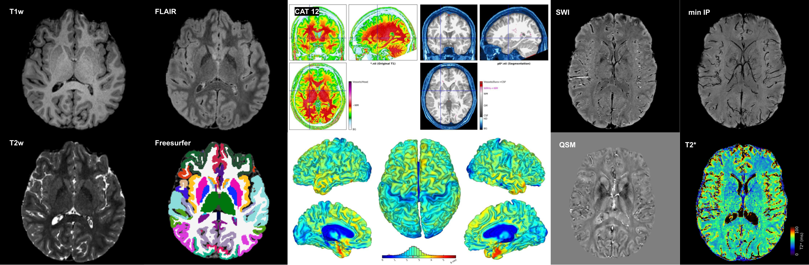

# BRAIN-To MRI Protocols Repository
This is a repository of wiki, code and containers for processing data acquired using the BRAIN-TO imaging protocols on Siemens MAGNETOM Prisma 3 T (XA30).

Please refer the article titled, [Advancing Clinical and Neuroscientific Research Through Accessible and Optimized Protocol Design at 3T](https://marketing.webassets.siemens-healthineers.com/ed15b22a01ec5497/ef408bcafa80/siemens-healthineers-magnetom-world-Kashyap_Uludag_BRAIN-TO_protocols.pdf), published in the RSNA Edition of Siemens MAGNETOM Flash (2023) for an overview.

#### Download Links for BRAIN-TO Protocols
1. Complete Set   [https://zenodo.org/records/10685481](https://zenodo.org/records/10685481)

2. Anatomy Set   [https://zenodo.org/records/10685475](https://zenodo.org/records/10685475)

3. fMRI Set   [https://zenodo.org/records/10685458](https://zenodo.org/records/10685458)

4. Diffusion Set   [https://zenodo.org/records/10685449](https://zenodo.org/records/10685449)

5. ASL Set   [https://zenodo.org/records/10685308](https://zenodo.org/records/10685308)

#### This repository is being updated steadily and include the following 
1. ~~Zenodo links for XA30 exar1 files~~
2. ~~Zenodo links for Protocol PDFs (for translating to other Prisma software versions)~~
3. Wiki with recommended pipelines and tools
4. Adding scripts and example code for processing data

#### Please feel free to contribute to our efforts. 
For urgent requests, please [e-mail](mailto:sriranga.kashyap@uhn.ca).

#### Contributors
Sriranga Kashyap, BRAIN-To Lab, Krembil Brain Institute, UHN 
Yuexin Xi, PhD Student, Dept. of Medical Biophysics, University of Toronto
